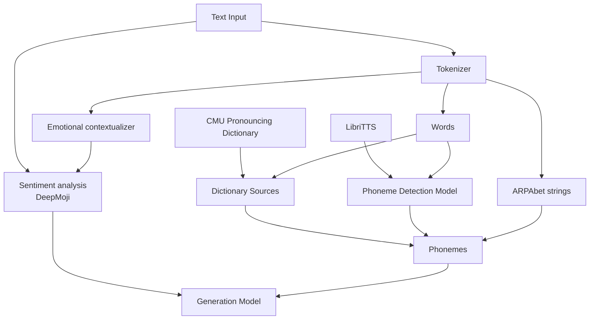

15ai is the hosting website for the model **DeepThroat**, a text-to-speech model that learns from as little as 15 seconds of speech data for a specific voice.

From their [about page](https://15.ai/about):

> This project aims to accurately clone voices given very little data with near complete human indistinguishability — in particular, 15 seconds of audio data is sufficient to clone a voice to meet human standards. Additional audio data facilitates the synthesis of convincing voices and makes it more difficult for a human to consistently differentiate between ground truth and synthesized voices. As of September 2021, DeepThroat is a significant improvement over every text-to-speech algorithm in existence.
>  
>  (...)
> 
> A dictionary lookup table is used to dissect each English word into its respective phonemes. The dictionary has been compiled by scraping the [Oxford Dictionaries API](https://developer.oxforddictionaries.com/), [Wiktionary](https://en.wiktionary.org/wiki/Wiktionary:Main_Page), and the [CMU Pronouncing Dictionary](http://www.speech.cs.cmu.edu/cgi-bin/cmudict). Modern neologisms are also scraped and culled from the Internet from various sources, including Google, Reddit, 4chan, and [Urban Dictionary](https://www.urbandictionary.com/). If a word does not exist within the dictionary, the network deduces the pronunciation of the word using the phonological rules it has learned from training on the [LibriTTS](https://research.google/tools/datasets/libri-tts/) dataset.
> 
> The perceived emotion of the input text is deduced using [DeepMoji](https://arxiv.org/pdf/1708.00524.pdf) ([deepmoji.mit.edu](https://deepmoji.mit.edu/)), a sentiment analysis model "trained on 1.2 billion tweets with emojis to understand how language is used to express emotions." This embedding is then used to bias the output toward the desired emotion using [global style tokens](https://arxiv.org/pdf/1803.09017.pdf) jointly trained on top of a customized [multi-speaker](https://arxiv.org/pdf/1910.10838.pdf) text-to-speech synthesis setup.
> 
> The DeepThroat model is able to generate voices of varying degrees of emotion despite never having been exposed to emotive data of the character during training. Furthermore, multiple characters can be trained simultaneously, significantly reducing the amount of time required compared to if one were to train the character models individually.
 
Extra information, from their Guide page:

> **Nondeterminism**
> 
> The model is [nondeterministic](https://en.wikipedia.org/wiki/Nondeterministic_algorithm). That is, re-clicking on the "Generate" button without changing the input will produce different outputs with varying levels of pacing, emotion, pitch, and background noise. This is by design (...)
> 
> Note that the output with the highest alignment confidence is not necessarily the best output. The alignment confidence is intended as a heuristic to cull the worst outputs; you will almost certainly encounter outliers where an output with a higher confidence clearly sounds worse than the other two outputs. (...)
> 
> **Emotional contextualizers**
> 
> The model uses *emotional contextualizers* (a term coined by this project) to alter the pacings and deliveries of spoken texts. An emotional contextualizer is an embedding that guides the model during inference toward an output of similar emotional context — simply put, it is a separate sentence or phrase that informs the model beforehand of the desired emotion of the output. The emotional contextualizer is mapped to a probability distribution using the sentiment analysis model [DeepMoji](https://arxiv.org/pdf/1708.00524.pdf) ([deepmoji.mit.edu](https://deepmoji.mit.edu/)), which gives a nice visualization of the desired emotion.
> 
> An emotional contextualizer can be specified in the input by adding a vertical bar (`|`) at the end of the spoken input followed by a sentence to be used as the contextualizer. For example, if one wishes to have a character speak the sentence `"I hate you!"` in an amorous manner (rather than an irate one), one may opt to use the input `"I hate you!|I love you."` to have the desired effect. It may take several tries with different emotional contextualizers to ultimately obtain the perfect output.
> 
> By default, if the emotional contextualizer is not specified, the inferred emotional contextualizer is assumed to be the input itself. For example, the input `"I hate you!"` is functionally identical to the input `"I hate you!|I hate you!"`.
> 
> **Phonological conventions and ARPAbet**
> 
> The model primarily uses the [Oxford English Dictionary's U.S English](https://public.oed.com/how-to-use-the-oed/key-to-pronunciation/%20pronunciation-model-US-english/) pronunciation model and its IPA conventions. This pronunciation model is the same one used by the dictionary built into Google's Search — to view the Oxford IPA transcription for a given word, type in "define [word]" into the search bar. For example, dictionary is transcribed as `/ˈdikSHəˌnerē/`, and convention is transcribed as `/kənˈven(t)SH(ə)n/`. Note the parenthesized phonemes that indicate optional [elisions](https://en.wikipedia.org/wiki/Elision) subconsciously prevalent in everyday speech.
> 
> You may notice that certain words are pronounced slightly differently than what you might expect. For example, suppose that you wish to have a character pronounce the word "Internet" as `/ˈintərˌnet/` with the phoneme `⟨t⟩` clearly enunciated in between the first and second syllables. The algorithm, however, may tend to favor the pronunciation `/ˈinərˌnet/`, opting to elide the `⟨t⟩` — the way that most Americans would pronounce the word "Internet" in everyday speech (this phonological phenomenon is known as [intervocalic flapping](https://en.wikipedia.org/wiki/Flapping)). If you wish, you can override the AI's preference by inserting ARPAbet strings wrapped in curly braces `{}` — in the case of "Internet," you would use the input `{IH1 N T ER0 N EH2 T}` instead to explicitly instruct the model to pronounce the `⟨t⟩`. In most cases, however, the AI does a very good job guessing the most appropriate pronunciation.
> 
> One important distinction between Oxford's IPA and traditional IPA is the lack of a distinct symbol for the voiced alveolar flap `⟨ɾ⟩`. In most dictionaries, the flap is transcribed as a `⟨t⟩`, but Oxford opts to transcribe it as a `⟨d⟩` in accordance to how Americans would pronounce the flap. For example, Oxford gives the transcription for the word better as `/ˈbedər/`, while most other dictionaries would opt to use the transcription `/ˈbetər/`. It is advised that users follow the Oxford convention to designate the voiced alveolar flap for optimal naturalness. For example, better would be transcribed as `{B EH1 D ER0}` instead of `{B EH1 T ER0}`.
> 
> All ARPAbet vowels must include a lexical stress. See the [CMU Pronouncing Dictionary](http://www.speech.cs.cmu.edu/cgi-bin/cmudict) website for more information on ARPAbet and a list of all valid phonemes usable on the site. Note that this site does not use the Oxford convention.
> 
> **Lexicon**
> 
> The lexicon that the model uses is an amalagmation of various dictionaries, words that have been scraped from both physical and digital references, and AI-generated phonetic transcriptions. While the lexicon contains many obscure and topical words that are not typically found in phonetic references (for example, the word VTuber — `/ˈvēˌto͞obər/` or `{V IY1 T UW2 B ER0}`), it is by no means complete. If you find a word that does not exist in the lexicon, or if you believe that a word may be incorrectly transcribed in the lexicon, feel free to send me an email or tag me in a tweet.

The author still hasn't published any details on how the voice generation model works internally, aside from these details on how the model is fed. So far, from what he explained, this is what we can gather:

The model was initially developed as part of [MIT's Undergraduate Research Opportunities Program](https://urop.mit.edu/).

Sources:
- [Website](https://15.ai/)
- [Author's Twitter](https://twitter.com/fifteenai) ("15", as internet calls him)